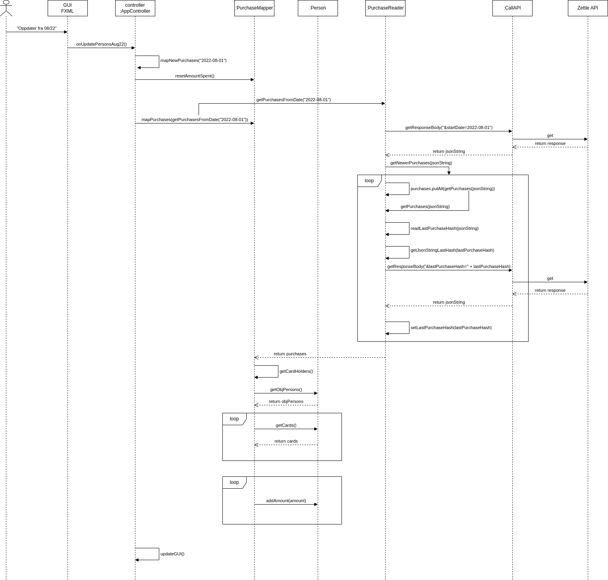

# Dokumentasjon av BeerTracker

## Del 1: Beskrivelse av appen

**BeerTracker** er en app for å holde en oppdatert oversikt over hva hver enkelt registrerte person har brukt av penger i baren på LaBamba.

Programmet holder kun oversikt over kjøp som er foretatt med bankkort. Det vil si at kjøp gjort med Vipps ikke inngår i oversikten.

Programmet laster ned kjøpshistorikk gjennom Zettle sitt API. Zettle er kortterminal-løsningen som LaBamba bruker.

Kortnummeret som er brukt i en transaksjon blir sjekket opp mot kortnumrene som er lagret hos de registrerte personene. Dersom en registrert person har et kortnummer som stemmer med kortnummeret brukt i en transaksjon, vil personen få kjøpesummen tillagt sin totale brukte sum.

Programmet sjekker hvert femte sekund etter nye kjøp. Dersom et nytt det finnes nye kjøp, blir den nevnte sjekkingen opp mot personenes kortnummere utført.

**Kilder**

[Dokumentasjon av Zettle API](https://developer.zettle.com/docs/api)

## Del 2: Diagram

Følgende diagram er et sekvensdiagram for handlingen "Oppdater fra 08/22".

Dette er en knapp i appen som kan trykkes på for å oppdatere kjøpesummen til de registrerte personene. Diagrammet viser hvordan programmet kontakter Zettle API-et og behandler kjøpehistorikken som blir returnert.

## Del 3: Spørsmål

### 1. Hvilke deler av pensum i emnet dekkes i prosjektet, og på hvilken måte?

Prosjektet dekker emner av pensum som innkapsling, arv, validering, feilhåndtering, filhåndtering, assosiasjoner, implementering av grensesnitt og bruk av lambda i funksjonelle grensesnitt.

### 2. Dersom deler av pensum ikke er dekket i prosjektet deres, hvordan kunne dere brukt disse delene av pensum i appen?

Prosjektet dekker ikke emner av pensum som delegering.

### 3. Hvordan forholder koden deres seg til Model-View-Controller-prinsippet?

Koden forholder seg til MVC-prinsippet ved at alle klasser utenom AppController-klassen er en del av "model", mens view og controller svarer til henholdsvis FXML-filen og AppController.

Noe logikk blir likevel utført i Controller-klassen. Dette er kode som med fordel kan plasseres i enten en av de eksisterende klassene eller sin egen klasse. Jeg har likevel valgt å ha koden i Controller-klassen ettersom koden er nødt til å interagere med brukergrensesnittet. Jeg synes derfor det er ryddigere å ha det som en del av Controller-klassen.

### 4. Hvordan har dere gått frem når dere skulle teste appen deres, og hvorfor har dere valgt de testene dere har? Har dere testet alle deler av koden? Hvis ikke, hvordan har dere prioritert hvilke deler som testes og ikke?

Jeg har ikke testet alle deler av koden, nei.

Jeg har valgt å teste lesing av persons.txt- og lastPurchaseHash.txt-filen. Jeg ønsker ikke å teste lagring til disse filene, ettersom det kan potensielt tukle med personer som er registrert. Det er ikke noe jeg ønsker å risikere.

Jeg har valgt å teste valideringsmetodene i Person-klassen. Dette er de eneste metodene i applikasjonen som validerer data, ettersom dette er eneste input som brukere kan komme med. Jeg antar derfor at data fra Zettle API-et er gyldig, men jeg ville ha lagt inn mer feilhåndtering i denne delen av koden dersom jeg hadde hatt mer tid.